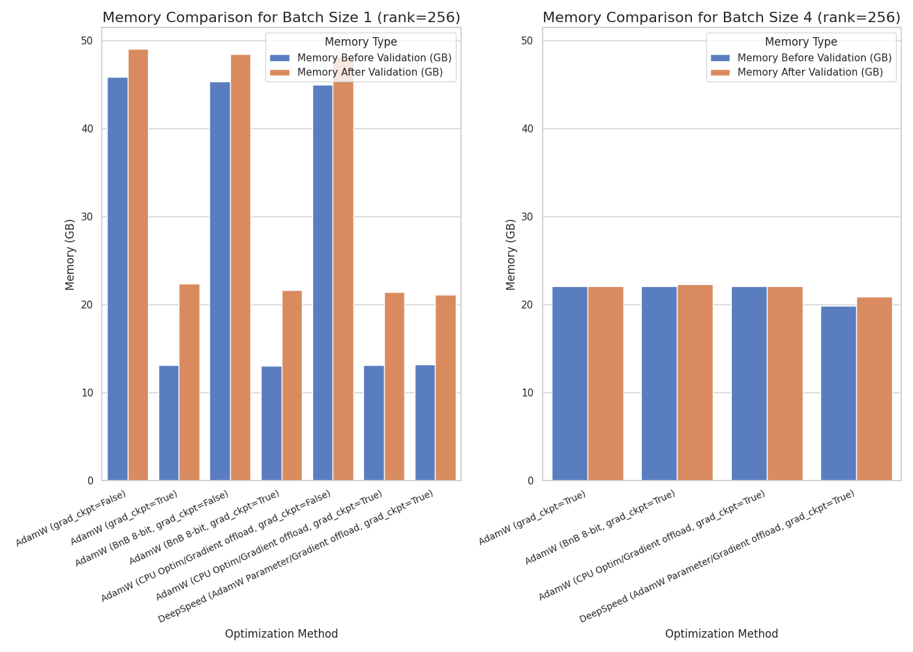
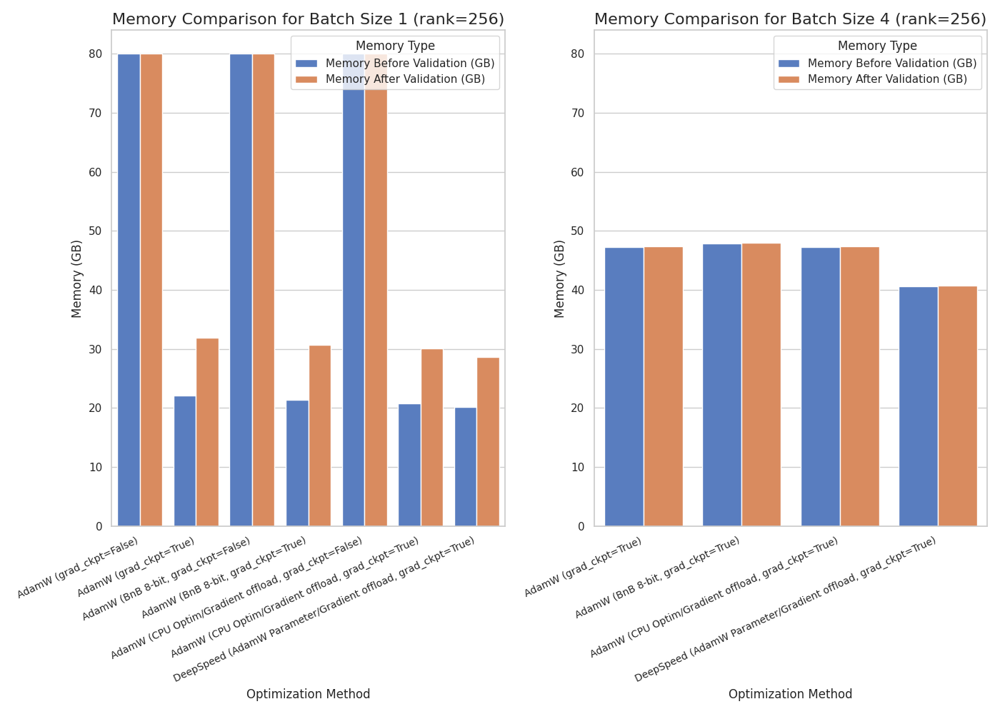
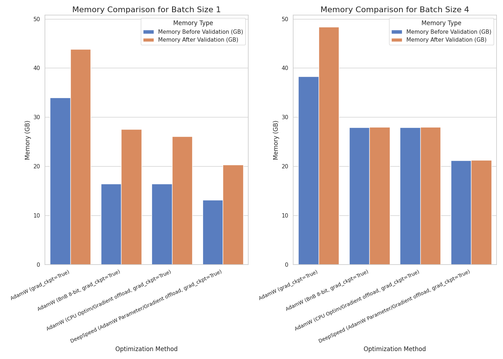
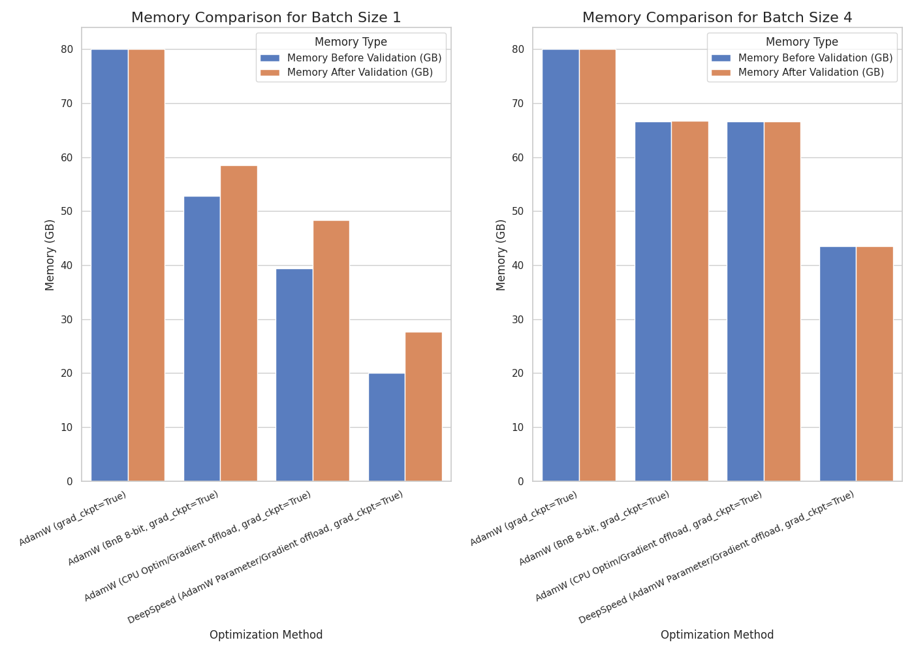

# finetrainers 🧪

`cogvideox-factory` was renamed to `finetrainers`. If you're looking to train CogVideoX or Mochi with the legacy training scripts, please refer to [this](./training/README.md) README instead. Everything in the `training/` directory will be eventually moved and supported under `finetrainers`.

FineTrainers is a work-in-progress library to support training of video models. The first priority is to support lora training for all models in [Diffusers](https://github.com/huggingface/diffusers), and eventually other methods like controlnets, control-loras, distillation, etc.

<table align="center">
<tr>
  <td align="center"><video src="https://github.com/user-attachments/assets/aad07161-87cb-4784-9e6b-16d06581e3e5">Your browser does not support the video tag.</video></td>
</tr>
</table>

## Quickstart

Clone the repository and make sure the requirements are installed: `pip install -r requirements.txt` and install diffusers from source by `pip install git+https://github.com/huggingface/diffusers`.

Then download a dataset:

```bash
# install `huggingface_hub`
huggingface-cli download \
  --repo-type dataset Wild-Heart/Disney-VideoGeneration-Dataset \
  --local-dir video-dataset-disney
```

Then launch LoRA fine-tuning. For CogVideoX and Mochi, refer to [this](./training/README.md) and [this](./training/mochi-1/README.md).

<details>
<summary> LTX Video </summary>

### Training:

```bash
#!/bin/bash

# export TORCH_LOGS="+dynamo,recompiles,graph_breaks"
# export TORCHDYNAMO_VERBOSE=1
export WANDB_MODE="offline"
export NCCL_P2P_DISABLE=1
export TORCH_NCCL_ENABLE_MONITORING=0
export FINETRAINERS_LOG_LEVEL=DEBUG

# Modify this based on the number of GPUs available
GPU_IDS="0,1"

DATA_ROOT="/path/to/dataset/cakify"
CAPTION_COLUMN="prompts.txt"
VIDEO_COLUMN="videos.txt"
OUTPUT_DIR="/path/to/output/directory/ltx-video/ltxv_cakify"

# Model arguments
model_cmd="--model_name ltx_video \
  --pretrained_model_name_or_path Lightricks/LTX-Video"

# Dataset arguments
dataset_cmd="--data_root $DATA_ROOT \
  --video_column $VIDEO_COLUMN \
  --caption_column $CAPTION_COLUMN \
  --id_token BW_STYLE \
  --video_resolution_buckets 49x512x768 \
  --caption_dropout_p 0.05"

# Dataloader arguments
dataloader_cmd="--dataloader_num_workers 0"

# Diffusion arguments
diffusion_cmd="--flow_resolution_shifting"

# Training arguments
training_cmd="--training_type lora \
  --seed 42 \
  --mixed_precision bf16 \
  --batch_size 1 \
  --train_steps 1200 \
  --rank 128 \
  --lora_alpha 128 \
  --target_modules to_q to_k to_v to_out.0 \
  --gradient_accumulation_steps 1 \
  --gradient_checkpointing \
  --checkpointing_steps 500 \
  --checkpointing_limit 2 \
  --enable_slicing \
  --enable_tiling"

# Optimizer arguments
optimizer_cmd="--optimizer adamw \
  --lr 1e-5 \
  --lr_scheduler constant \
  --lr_warmup_steps 100 \
  --lr_num_cycles 1 \
  --beta1 0.9 \
  --beta2 0.95 \
  --weight_decay 1e-4 \
  --epsilon 1e-8 \
  --max_grad_norm 1.0"

# Validation arguments
validation_cmd="--validation_prompts \"BW_STYLE A black and white animated scene unfolds with an anthropomorphic goat surrounded by musical notes and symbols, suggesting a playful environment. Mickey Mouse appears, leaning forward in curiosity as the goat remains still. The goat then engages with Mickey, who bends down to converse or react. The dynamics shift as Mickey grabs the goat, potentially in surprise or playfulness, amidst a minimalistic background. The scene captures the evolving relationship between the two characters in a whimsical, animated setting, emphasizing their interactions and emotions@@@49x512x768:::BW_STYLE A black and white animated scene unfolds with an anthropomorphic goat surrounded by musical notes and symbols, suggesting a playful environment. Mickey Mouse appears, leaning forward in curiosity as the goat remains still. The goat then engages with Mickey, who bends down to converse or react. The dynamics shift as Mickey grabs the goat, potentially in surprise or playfulness, amidst a minimalistic background. The scene captures the evolving relationship between the two characters in a whimsical, animated setting, emphasizing their interactions and emotions@@@129x512x768:::BW_STYLE A panda, dressed in a small, red jacket and a tiny hat, sits on a wooden stool in a serene bamboo forest. The panda's fluffy paws strum a miniature acoustic guitar, producing soft, melodic tunes. Nearby, a few other pandas gather, watching curiously and some clapping in rhythm. Sunlight filters through the tall bamboo, casting a gentle glow on the scene. The panda's face is expressive, showing concentration and joy as it plays. The background includes a small, flowing stream and vibrant green foliage, enhancing the peaceful and magical atmosphere of this unique musical performance@@@49x512x768\" \
  --num_validation_videos 1 \
  --validation_steps 100"

# Miscellaneous arguments
miscellaneous_cmd="--tracker_name finetrainers-ltxv \
  --output_dir $OUTPUT_DIR \
  --nccl_timeout 1800 \
  --report_to wandb"

cmd="accelerate launch --config_file accelerate_configs/uncompiled_2.yaml --gpu_ids $GPU_IDS train.py \
  $model_cmd \
  $dataset_cmd \
  $dataloader_cmd \
  $diffusion_cmd \
  $training_cmd \
  $optimizer_cmd \
  $validation_cmd \
  $miscellaneous_cmd"

echo "Running command: $cmd"
eval $cmd
echo -ne "-------------------- Finished executing script --------------------\n\n"
```

### Inference:

Assuming your LoRA is saved and pushed to the HF Hub, and named `my-awesome-name/my-awesome-lora`, we can now use the finetuned model for inference:

```diff
import torch
from diffusers import LTXPipeline
from diffusers.utils import export_to_video

pipe = LTXPipeline.from_pretrained(
    "Lightricks/LTX-Video", torch_dtype=torch.bfloat16
).to("cuda")
+ pipe.load_lora_weights("my-awesome-name/my-awesome-lora", adapter_name="ltxv-lora")
+ pipe.set_adapters(["ltxv-lora"], [0.75])

video = pipe("<my-awesome-prompt>").frames[0]
export_to_video(video, "output.mp4", fps=8)
```

</details>

<details>
<summary> Hunyuan Video </summary>

### Training:

```bash
#!/bin/bash

# export TORCH_LOGS="+dynamo,recompiles,graph_breaks"
# export TORCHDYNAMO_VERBOSE=1
export WANDB_MODE="offline"
export NCCL_P2P_DISABLE=1
export TORCH_NCCL_ENABLE_MONITORING=0
export FINETRAINERS_LOG_LEVEL=DEBUG

GPU_IDS="0,1,2,3,4,5,6,7"

DATA_ROOT="/path/to/dataset"
CAPTION_COLUMN="prompts.txt"
VIDEO_COLUMN="videos.txt"
OUTPUT_DIR="/path/to/models/hunyuan-video/hunyuan-video-loras/hunyuan-video_cakify_500_3e-5_constant_with_warmup"

# Model arguments
model_cmd="--model_name hunyuan_video \
  --pretrained_model_name_or_path tencent/HunyuanVideo
  --revision refs/pr/18"

# Dataset arguments
dataset_cmd="--data_root $DATA_ROOT \
  --video_column $VIDEO_COLUMN \
  --caption_column $CAPTION_COLUMN \
  --id_token afkx \
  --video_resolution_buckets 17x512x768 49x512x768 61x512x768 129x512x768 \
  --caption_dropout_p 0.05"

# Dataloader arguments
dataloader_cmd="--dataloader_num_workers 0"

# Diffusion arguments
diffusion_cmd=""

# Training arguments
training_cmd="--training_type lora \
  --seed 42 \
  --mixed_precision bf16 \
  --batch_size 1 \
  --train_steps 500 \
  --rank 128 \
  --lora_alpha 128 \
  --target_modules to_q to_k to_v to_out.0 \
  --gradient_accumulation_steps 1 \
  --gradient_checkpointing \
  --checkpointing_steps 500 \
  --checkpointing_limit 2 \
  --enable_slicing \
  --enable_tiling"

# Optimizer arguments
optimizer_cmd="--optimizer adamw \
  --lr 3e-5 \
  --lr_scheduler constant_with_warmup \
  --lr_warmup_steps 100 \
  --lr_num_cycles 1 \
  --beta1 0.9 \
  --beta2 0.95 \
  --weight_decay 1e-4 \
  --epsilon 1e-8 \
  --max_grad_norm 1.0"

# Validation arguments
validation_cmd="--validation_prompts \"afkx A baker carefully cuts a green bell pepper cake on a white plate against a bright yellow background, followed by a strawberry cake with a similar slice of cake being cut before the interior of the bell pepper cake is revealed with the surrounding cake-to-object sequence.@@@49x512x768:::afkx A cake shaped like a Nutella container is carefully sliced, revealing a light interior, amidst a Nutella-themed setup, showcasing deliberate cutting and preserved details for an appetizing dessert presentation on a white base with accompanying jello and cutlery, highlighting culinary skills and creative cake designs.@@@49x512x768:::afkx A cake shaped like a Nutella container is carefully sliced, revealing a light interior, amidst a Nutella-themed setup, showcasing deliberate cutting and preserved details for an appetizing dessert presentation on a white base with accompanying jello and cutlery, highlighting culinary skills and creative cake designs.@@@61x512x768:::afkx A vibrant orange cake disguised as a Nike packaging box sits on a dark surface, meticulous in its detail and design, complete with a white swoosh and 'NIKE' logo. A person's hands, holding a knife, hover over the cake, ready to make a precise cut, amidst a simple and clean background.@@@61x512x768:::afkx A vibrant orange cake disguised as a Nike packaging box sits on a dark surface, meticulous in its detail and design, complete with a white swoosh and 'NIKE' logo. A person's hands, holding a knife, hover over the cake, ready to make a precise cut, amidst a simple and clean background.@@@97x512x768:::afkx A vibrant orange cake disguised as a Nike packaging box sits on a dark surface, meticulous in its detail and design, complete with a white swoosh and 'NIKE' logo. A person's hands, holding a knife, hover over the cake, ready to make a precise cut, amidst a simple and clean background.@@@129x512x768:::A person with gloved hands carefully cuts a cake shaped like a Skittles bottle, beginning with a precise incision at the lid, followed by careful sequential cuts around the neck, eventually detaching the lid from the body, revealing the chocolate interior of the cake while showcasing the layered design's detail.@@@61x512x768:::afkx A woman with long brown hair and light skin smiles at another woman with long blonde hair. The woman with brown hair wears a black jacket and has a small, barely noticeable mole on her right cheek. The camera angle is a close-up, focused on the woman with brown hair's face. The lighting is warm and natural, likely from the setting sun, casting a soft glow on the scene. The scene appears to be real-life footage@@@61x512x768\" \
  --num_validation_videos 1 \
  --validation_steps 100"

# Miscellaneous arguments
miscellaneous_cmd="--tracker_name finetrainers-hunyuan-video \
  --output_dir $OUTPUT_DIR \
  --nccl_timeout 1800 \
  --report_to wandb"

cmd="accelerate launch --config_file accelerate_configs/uncompiled_8.yaml --gpu_ids $GPU_IDS train.py \
  $model_cmd \
  $dataset_cmd \
  $dataloader_cmd \
  $diffusion_cmd \
  $training_cmd \
  $optimizer_cmd \
  $validation_cmd \
  $miscellaneous_cmd"

echo "Running command: $cmd"
eval $cmd
echo -ne "-------------------- Finished executing script --------------------\n\n"
```

### Inference:

Assuming your LoRA is saved and pushed to the HF Hub, and named `my-awesome-name/my-awesome-lora`, we can now use the finetuned model for inference:

```py
import torch
from diffusers import HunyuanVideoPipeline

import torch
from diffusers import HunyuanVideoPipeline, HunyuanVideoTransformer3DModel
from diffusers.utils import export_to_video

model_id = "tencent/HunyuanVideo"
transformer = HunyuanVideoTransformer3DModel.from_pretrained(
    model_id, subfolder="transformer", torch_dtype=torch.bfloat16
)
pipe = HunyuanVideoPipeline.from_pretrained(model_id, transformer=transformer, torch_dtype=torch.float16)
pipe.load_lora_weights("my-awesome-name/my-awesome-lora", adapter_name="hunyuanvideo-lora")
pipe.set_adapters(["hunyuanvideo-lora"], [0.6])
pipe.vae.enable_tiling()
pipe.to("cuda")

output = pipe(
    prompt="A cat walks on the grass, realistic",
    height=320,
    width=512,
    num_frames=61,
    num_inference_steps=30,
).frames[0]
export_to_video(output, "output.mp4", fps=15)
```

</details>

If you would like to use a custom dataset, refer to the dataset preparation guide [here](./assets/dataset.md).

## Memory requirements

<table align="center">
<tr>
  <td align="center" colspan="2"><b>CogVideoX LoRA Finetuning</b></td>
</tr>
<tr>
  <td align="center"><a href="https://huggingface.co/THUDM/CogVideoX-2b">THUDM/CogVideoX-2b</a></td>
  <td align="center"><a href="https://huggingface.co/THUDM/CogVideoX-5b">THUDM/CogVideoX-5b</a></td>
</tr>
<tr>
  <td align="center"></td>
  <td align="center"></td>
</tr>

<tr>
  <td align="center" colspan="2"><b>CogVideoX Full Finetuning</b></td>
</tr>
<tr>
  <td align="center"><a href="https://huggingface.co/THUDM/CogVideoX-2b">THUDM/CogVideoX-2b</a></td>
  <td align="center"><a href="https://huggingface.co/THUDM/CogVideoX-5b">THUDM/CogVideoX-5b</a></td>
</tr>
<tr>
  <td align="center"></td>
  <td align="center"></td>
</tr>
</table>

Supported and verified memory optimizations for training include:

- `CPUOffloadOptimizer` from [`torchao`](https://github.com/pytorch/ao). You can read about its capabilities and limitations [here](https://github.com/pytorch/ao/tree/main/torchao/prototype/low_bit_optim#optimizer-cpu-offload). In short, it allows you to use the CPU for storing trainable parameters and gradients. This results in the optimizer step happening on the CPU, which requires a fast CPU optimizer, such as `torch.optim.AdamW(fused=True)` or applying `torch.compile` on the optimizer step. Additionally, it is recommended not to `torch.compile` your model for training. Gradient clipping and accumulation is not supported yet either.
- Low-bit optimizers from [`bitsandbytes`](https://huggingface.co/docs/bitsandbytes/optimizers). TODO: to test and make [`torchao`](https://github.com/pytorch/ao/tree/main/torchao/prototype/low_bit_optim) ones work
- DeepSpeed Zero2: Since we rely on `accelerate`, follow [this guide](https://huggingface.co/docs/accelerate/en/usage_guides/deepspeed) to configure your `accelerate` installation to enable training with DeepSpeed Zero2 optimizations. 

> [!IMPORTANT]
> The memory requirements are reported after running the `training/prepare_dataset.py`, which converts the videos and captions to latents and embeddings. During training, we directly load the latents and embeddings, and do not require the VAE or the T5 text encoder. However, if you perform validation/testing, these must be loaded and increase the amount of required memory. Not performing validation/testing saves a significant amount of memory, which can be used to focus solely on training if you're on smaller VRAM GPUs.
>
> If you choose to run validation/testing, you can save some memory on lower VRAM GPUs by specifying `--enable_model_cpu_offload`.

### LoRA finetuning

> [!NOTE]
> The memory requirements for image-to-video lora finetuning are similar to that of text-to-video on `THUDM/CogVideoX-5b`, so it hasn't been reported explicitly.
>
> Additionally, to prepare test images for I2V finetuning, you could either generate them on-the-fly by modifying the script, or extract some frames from your training data using:
> `ffmpeg -i input.mp4 -frames:v 1 frame.png`,
> or provide a URL to a valid and accessible image.

<details>
<summary> AdamW </summary>

**Note:** Trying to run CogVideoX-5b without gradient checkpointing OOMs even on an A100 (80 GB), so the memory measurements have not been specified.

With `train_batch_size = 1`:

|       model        | lora rank | gradient_checkpointing | memory_before_training | memory_before_validation | memory_after_validation | memory_after_testing |
|:------------------:|:---------:|:----------------------:|:----------------------:|:------------------------:|:-----------------------:|:--------------------:|
| THUDM/CogVideoX-2b |    16     |          False         |         12.945         |          43.764          |         46.918          |       24.234         |
| THUDM/CogVideoX-2b |    16     |          True          |         12.945         |          12.945          |         21.121          |       24.234         |
| THUDM/CogVideoX-2b |    64     |          False         |         13.035         |          44.314          |         47.469          |       24.469         |
| THUDM/CogVideoX-2b |    64     |          True          |         13.036         |          13.035          |         21.564          |       24.500         |
| THUDM/CogVideoX-2b |    256    |          False         |         13.095         |          45.826          |         48.990          |       25.543         |
| THUDM/CogVideoX-2b |    256    |          True          |         13.094         |          13.095          |         22.344          |       25.537         |
| THUDM/CogVideoX-5b |    16     |          True          |         19.742         |          19.742          |         28.746          |       38.123         |
| THUDM/CogVideoX-5b |    64     |          True          |         20.006         |          20.818          |         30.338          |       38.738         |
| THUDM/CogVideoX-5b |    256    |          True          |         20.771         |          22.119          |         31.939          |       41.537         |

With `train_batch_size = 4`:

|       model        | lora rank | gradient_checkpointing | memory_before_training | memory_before_validation | memory_after_validation | memory_after_testing |
|:------------------:|:---------:|:----------------------:|:----------------------:|:------------------------:|:-----------------------:|:--------------------:|
| THUDM/CogVideoX-2b |    16     |          True          |         12.945         |          21.803          |         21.814          |       24.322         |
| THUDM/CogVideoX-2b |    64     |          True          |         13.035         |          22.254          |         22.254          |       24.572         |
| THUDM/CogVideoX-2b |    256    |          True          |         13.094         |          22.020          |         22.033          |       25.574         |
| THUDM/CogVideoX-5b |    16     |          True          |         19.742         |          46.492          |         46.492          |       38.197         |
| THUDM/CogVideoX-5b |    64     |          True          |         20.006         |          47.805          |         47.805          |       39.365         |
| THUDM/CogVideoX-5b |    256    |          True          |         20.771         |          47.268          |         47.332          |       41.008         |

</details>

<details>
<summary> AdamW (8-bit bitsandbytes) </summary>

**Note:** Trying to run CogVideoX-5b without gradient checkpointing OOMs even on an A100 (80 GB), so the memory measurements have not been specified.

With `train_batch_size = 1`:

|       model        | lora rank | gradient_checkpointing | memory_before_training | memory_before_validation | memory_after_validation | memory_after_testing |
|:------------------:|:---------:|:----------------------:|:----------------------:|:------------------------:|:-----------------------:|:--------------------:|
| THUDM/CogVideoX-2b |    16     |          False         |         12.945         |          43.732          |         46.887          |        24.195        |
| THUDM/CogVideoX-2b |    16     |          True          |         12.945         |          12.945          |         21.430          |        24.195        |
| THUDM/CogVideoX-2b |    64     |          False         |         13.035         |          44.004          |         47.158          |        24.369        |
| THUDM/CogVideoX-2b |    64     |          True          |         13.035         |          13.035          |         21.297          |        24.357        |
| THUDM/CogVideoX-2b |    256    |          False         |         13.035         |          45.291          |         48.455          |        24.836        |
| THUDM/CogVideoX-2b |    256    |          True          |         13.035         |          13.035          |         21.625          |        24.869        |
| THUDM/CogVideoX-5b |    16     |          True          |         19.742         |          19.742          |         28.602          |        38.049        |
| THUDM/CogVideoX-5b |    64     |          True          |         20.006         |          20.818          |         29.359          |        38.520        |
| THUDM/CogVideoX-5b |    256    |          True          |         20.771         |          21.352          |         30.727          |        39.596        |

With `train_batch_size = 4`:

|       model        | lora rank | gradient_checkpointing | memory_before_training | memory_before_validation | memory_after_validation | memory_after_testing |
|:------------------:|:---------:|:----------------------:|:----------------------:|:------------------------:|:-----------------------:|:--------------------:|
| THUDM/CogVideoX-2b |    16     |          True          |         12.945         |          21.734          |         21.775          |       24.281         |
| THUDM/CogVideoX-2b |    64     |          True          |         13.036         |          21.941          |         21.941          |       24.445         |
| THUDM/CogVideoX-2b |    256    |          True          |         13.094         |          22.020          |         22.266          |       24.943         |
| THUDM/CogVideoX-5b |    16     |          True          |         19.742         |          46.320          |         46.326          |       38.104         |
| THUDM/CogVideoX-5b |    64     |          True          |         20.006         |          46.820          |         46.820          |       38.588         |
| THUDM/CogVideoX-5b |    256    |          True          |         20.771         |          47.920          |         47.980          |       40.002         |

</details>

<details>
<summary> AdamW + CPUOffloadOptimizer (with gradient offloading) </summary>

**Note:** Trying to run CogVideoX-5b without gradient checkpointing OOMs even on an A100 (80 GB), so the memory measurements have not been specified.

With `train_batch_size = 1`:

|       model        | lora rank | gradient_checkpointing | memory_before_training | memory_before_validation | memory_after_validation | memory_after_testing |
|:------------------:|:---------:|:----------------------:|:----------------------:|:------------------------:|:-----------------------:|:--------------------:|
| THUDM/CogVideoX-2b |    16     |          False         |         12.945         |          43.705          |         46.859          |       24.180         |
| THUDM/CogVideoX-2b |    16     |          True          |         12.945         |          12.945          |         21.395          |       24.180         |
| THUDM/CogVideoX-2b |    64     |          False         |         13.035         |          43.916          |         47.070          |       24.234         |
| THUDM/CogVideoX-2b |    64     |          True          |         13.035         |          13.035          |         20.887          |       24.266         |
| THUDM/CogVideoX-2b |    256    |          False         |         13.095         |          44.947          |         48.111          |       24.607         |
| THUDM/CogVideoX-2b |    256    |          True          |         13.095         |          13.095          |         21.391          |       24.635         |
| THUDM/CogVideoX-5b |    16     |          True          |         19.742         |          19.742          |         28.533          |       38.002         |
| THUDM/CogVideoX-5b |    64     |          True          |         20.006         |          20.006          |         29.107          |       38.785         |
| THUDM/CogVideoX-5b |    256    |          True          |         20.771         |          20.771          |         30.078          |       39.559         |

With `train_batch_size = 4`:

|       model        | lora rank | gradient_checkpointing | memory_before_training | memory_before_validation | memory_after_validation | memory_after_testing |
|:------------------:|:---------:|:----------------------:|:----------------------:|:------------------------:|:-----------------------:|:--------------------:|
| THUDM/CogVideoX-2b |    16     |          True          |         12.945         |          21.709          |         21.762          |       24.254         |
| THUDM/CogVideoX-2b |    64     |          True          |         13.035         |          21.844          |         21.855          |       24.338         |
| THUDM/CogVideoX-2b |    256    |          True          |         13.094         |          22.020          |         22.031          |       24.709         |
| THUDM/CogVideoX-5b |    16     |          True          |         19.742         |          46.262          |         46.297          |       38.400         |
| THUDM/CogVideoX-5b |    64     |          True          |         20.006         |          46.561          |         46.574          |       38.840         |
| THUDM/CogVideoX-5b |    256    |          True          |         20.771         |          47.268          |         47.332          |       39.623         |

</details>

<details>
<summary> DeepSpeed (AdamW + CPU/Parameter offloading) </summary>

**Note:** Results are reported with `gradient_checkpointing` enabled, running on a 2x A100.

With `train_batch_size = 1`:

|       model        | memory_before_training | memory_before_validation | memory_after_validation | memory_after_testing |
|:------------------:|:----------------------:|:------------------------:|:-----------------------:|:--------------------:|
| THUDM/CogVideoX-2b |         13.141         |          13.141          |         21.070          |       24.602         |
| THUDM/CogVideoX-5b |         20.170         |          20.170          |         28.662          |       38.957         |

With `train_batch_size = 4`:

|       model        | memory_before_training | memory_before_validation | memory_after_validation | memory_after_testing |
|:------------------:|:----------------------:|:------------------------:|:-----------------------:|:--------------------:|
| THUDM/CogVideoX-2b |         13.141         |          19.854          |         20.836          |       24.709         |
| THUDM/CogVideoX-5b |         20.170         |          40.635          |         40.699          |       39.027         |

</details>

### Full finetuning

> [!NOTE]
> The memory requirements for image-to-video full finetuning are similar to that of text-to-video on `THUDM/CogVideoX-5b`, so it hasn't been reported explicitly.
>
> Additionally, to prepare test images for I2V finetuning, you could either generate them on-the-fly by modifying the script, or extract some frames from your training data using:
> `ffmpeg -i input.mp4 -frames:v 1 frame.png`,
> or provide a URL to a valid and accessible image.

> [!NOTE]
> Trying to run full finetuning without gradient checkpointing OOMs even on an A100 (80 GB), so the memory measurements have not been specified.

<details>
<summary> AdamW </summary>

With `train_batch_size = 1`:

|       model        | gradient_checkpointing | memory_before_training | memory_before_validation | memory_after_validation | memory_after_testing |
|:------------------:|:----------------------:|:----------------------:|:------------------------:|:-----------------------:|:--------------------:|
| THUDM/CogVideoX-2b |          True          |         16.396         |          33.934          |         43.848          |       37.520         |
| THUDM/CogVideoX-5b |          True          |         30.061         |          OOM             |         OOM             |       OOM            |

With `train_batch_size = 4`:

|       model        | gradient_checkpointing | memory_before_training | memory_before_validation | memory_after_validation | memory_after_testing |
|:------------------:|:----------------------:|:----------------------:|:------------------------:|:-----------------------:|:--------------------:|
| THUDM/CogVideoX-2b |          True          |         16.396         |          38.281          |         48.341          |       37.544         |
| THUDM/CogVideoX-5b |          True          |         30.061         |          OOM             |         OOM             |       OOM            |

</details>

<details>
<summary> AdamW (8-bit bitsandbytes) </summary>

With `train_batch_size = 1`:

|       model        | gradient_checkpointing | memory_before_training | memory_before_validation | memory_after_validation | memory_after_testing |
|:------------------:|:----------------------:|:----------------------:|:------------------------:|:-----------------------:|:--------------------:|
| THUDM/CogVideoX-2b |          True          |         16.396         |          16.447          |         27.555          |       27.156         |
| THUDM/CogVideoX-5b |          True          |         30.061         |          52.826          |         58.570          |       49.541         |

With `train_batch_size = 4`:

|       model        | gradient_checkpointing | memory_before_training | memory_before_validation | memory_after_validation | memory_after_testing |
|:------------------:|:----------------------:|:----------------------:|:------------------------:|:-----------------------:|:--------------------:|
| THUDM/CogVideoX-2b |          True          |         16.396         |          27.930          |         27.990          |       27.326         |
| THUDM/CogVideoX-5b |          True          |         16.396         |          66.648          |         66.705          |       48.828         |

</details>

<details>
<summary> AdamW + CPUOffloadOptimizer (with gradient offloading) </summary>

With `train_batch_size = 1`:

|       model        | gradient_checkpointing | memory_before_training | memory_before_validation | memory_after_validation | memory_after_testing |
|:------------------:|:----------------------:|:----------------------:|:------------------------:|:-----------------------:|:--------------------:|
| THUDM/CogVideoX-2b |          True          |         16.396         |          16.396          |         26.100          |       23.832         |
| THUDM/CogVideoX-5b |          True          |         30.061         |          39.359          |         48.307          |       37.947         |

With `train_batch_size = 4`:

|       model        | gradient_checkpointing | memory_before_training | memory_before_validation | memory_after_validation | memory_after_testing |
|:------------------:|:----------------------:|:----------------------:|:------------------------:|:-----------------------:|:--------------------:|
| THUDM/CogVideoX-2b |          True          |         16.396         |          27.916          |         27.975          |       23.936         |
| THUDM/CogVideoX-5b |          True          |         30.061         |          66.607          |         66.668          |       38.061         |

</details>

<details>
<summary> DeepSpeed (AdamW + CPU/Parameter offloading) </summary>

**Note:** Results are reported with `gradient_checkpointing` enabled, running on a 2x A100.

With `train_batch_size = 1`:

|       model        | memory_before_training | memory_before_validation | memory_after_validation | memory_after_testing |
|:------------------:|:----------------------:|:------------------------:|:-----------------------:|:--------------------:|
| THUDM/CogVideoX-2b |         13.111         |          13.111          |         20.328          |       23.867         |
| THUDM/CogVideoX-5b |         19.762         |          19.998          |         27.697          |       38.018         |

With `train_batch_size = 4`:

|       model        | memory_before_training | memory_before_validation | memory_after_validation | memory_after_testing |
|:------------------:|:----------------------:|:------------------------:|:-----------------------:|:--------------------:|
| THUDM/CogVideoX-2b |         13.111         |          21.188          |         21.254          |       23.869         |
| THUDM/CogVideoX-5b |         19.762         |          43.465          |         43.531          |       38.082         |

</details>

> [!NOTE]
> - `memory_after_validation` is indicative of the peak memory required for training. This is because apart from the activations, parameters and gradients stored for training, you also need to load the vae and text encoder in memory and spend some memory to perform inference. In order to reduce total memory required to perform training, one can choose not to perform validation/testing as part of the training script.
>
> - `memory_before_validation` is the true indicator of the peak memory required for training if you choose to not perform validation/testing.

<table align="center">
<tr>
  <td align="center"><a href="https://www.youtube.com/watch?v=UvRl4ansfCg"> Slaying OOMs with PyTorch</a></td>
</tr>
<tr>
  <td align="center"></td>
</tr>
</table>
