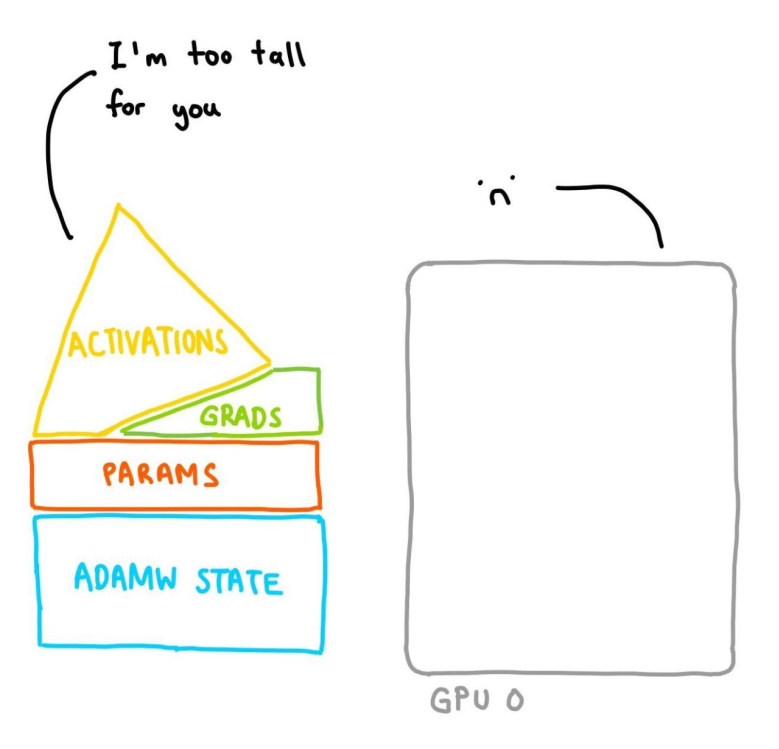

# CogVideoX Factory 🧪

Fine-tune Cog family of video models for custom video generation under 24GB of GPU memory ⚡️📼

TODO: Add table with fun video results

## Quickstart

Make sure the requirements are installed: `pip install -r requirements.txt`. 

Then download a dataset:

```bash
# install `huggingface_hub`
huggingface-cli download \
  --repo-type dataset Wild-Heart/Disney-VideoGeneration-Dataset \
  --local-dir video-dataset-disney
```

Then launch LoRA fine-tuning for text-to-video:

```bash
TODO
```

We can now use the trained model for inference:

```python
TODO
```

We can also fine-tune the 5B variant with LoRA:

```python
TODO
```

Below we provide additional sections detailing on more options we provide in this repository. They all attempt to make fine-tuning for video models as accessible as possible. 

## Dataset Preparation

Create two files where one file contains line-separated prompts and another file contains line-separated paths to video data (the path to video files must be relative to the path you pass when specifying `--data_root`). Let's take a look at an example to understand this better!

Assume you've specified `--data_root` as `/dataset`, and that this directory contains the files: `prompts.txt` and `videos.txt`.

The `prompts.txt` file should contain line-separated prompts:

```
A black and white animated sequence featuring a rabbit, named Rabbity Ribfried, and an anthropomorphic goat in a musical, playful environment, showcasing their evolving interaction.
A black and white animated sequence on a ship's deck features a bulldog character, named Bully Bulldoger, showcasing exaggerated facial expressions and body language. The character progresses from confident to focused, then to strained and distressed, displaying a range of emotions as it navigates challenges. The ship's interior remains static in the background, with minimalistic details such as a bell and open door. The character's dynamic movements and changing expressions drive the narrative, with no camera movement to distract from its evolving reactions and physical gestures.
...
```

The `videos.txt` file should contain line-separate paths to video files. Note that the path should be _relative_ to the `--data_root` directory.

```bash
videos/00000.mp4
videos/00001.mp4
...
```

Overall, this is how your dataset would look like if you ran the `tree` command on the dataset root directory:

```bash
/dataset
├── prompts.txt
├── videos.txt
├── videos
    ├── videos/00000.mp4
    ├── videos/00001.mp4
    ├── ...
```

When using this format, the `--caption_column` must be `prompts.txt` and `--video_column` must be `videos.txt`. If you, instead, have your data stored in a CSV file, you can also specify `--dataset_file` as the path to CSV, the `--caption_column` and `--video_column` as the actual column names in the CSV file.

As an example, let's use [this](https://huggingface.co/datasets/Wild-Heart/Disney-VideoGeneration-Dataset) Disney dataset for finetuning. To download, one can use the 🤗 Hugging Face CLI.

```bash
huggingface-cli download --repo-type dataset Wild-Heart/Disney-VideoGeneration-Dataset --local-dir video-dataset-disney
```

TODO: Add a section on creating and using precomputed embeddings.

## Training

We provide training script for both text-to-video and image-to-video generation which are compatible with the [Cog family of models](https://huggingface.co/collections/THUDM/cogvideo-66c08e62f1685a3ade464cce).

Take a look at `training/*.sh`

Note: Untested on MPS

## Memory requirements

<table align="center">
<tr>
  <td align="center"><a href="https://www.youtube.com/watch?v=UvRl4ansfCg"> Slaying OOMs with PyTorch</a></td>
</tr>
<tr>
  <td align="center"></td>
</tr>
</table>

Supported and verified memory optimizations for training include:

- `CPUOffloadOptimizer` from [`torchao`](https://github.com/pytorch/ao). You can read about its capabilities and limitations [here](https://github.com/pytorch/ao/tree/main/torchao/prototype/low_bit_optim#optimizer-cpu-offload). In short, it allows you to use the CPU for storing trainable parameters and gradients. This results in the optimizer step happening on the CPU, which requires a fast CPU optimizer, such as `torch.optim.AdamW(fused=True)` or applying `torch.compile` on the optimizer step. Additionally, it is recommended to not `torch.compile` your model for training. Gradient clipping and accumulation is not supported yet either.
- Low-bit optimizers from [`bitsandbytes`](https://huggingface.co/docs/bitsandbytes/optimizers). TODO: to test and make [`torchao`](https://github.com/pytorch/ao/tree/main/torchao/prototype/low_bit_optim) ones work
- DeepSpeed Zero2: Since we rely on `accelerate`, follow [this guide](https://huggingface.co/docs/accelerate/en/usage_guides/deepspeed) to configure your `accelerate` installation to enable training with DeepSpeed Zero2 optimizations. 

> [!IMPORTANT]
> The memory requirements are reported after running the `training/prepare_dataset.py`, which converts the videos and captions to latents and embeddings. During training, we directly load the latents and embeddings, and do not require the VAE or the T5 text encoder. However, if you perform validation/testing, these must be loaded and increase the amount of required memory. Not performing validation/testing saves a significant amount of memory, which can be used to focus solely on training if you're on smaller VRAM GPUs.

### LoRA finetuning

<details>
<summary> AdamW </summary>

With `train_batch_size = 1`:

|       model        | lora rank | gradient_checkpointing | memory_before_training | memory_before_validation | memory_after_validation | memory_after_testing |
|:------------------:|:---------:|:----------------------:|:----------------------:|:------------------------:|:-----------------------:|:--------------------:|
| THUDM/CogVideoX-2b |    16     |          False         |         12.945         |          43.764          |         46.918          |       24.234         |
| THUDM/CogVideoX-2b |    16     |          True          |         12.945         |          12.945          |         21.121          |       24.234         |
| THUDM/CogVideoX-2b |    64     |          False         |         13.035         |          44.314          |         47.469          |       24.469         |
| THUDM/CogVideoX-2b |    64     |          True          |         13.036         |          13.035          |         21.564          |       24.500         |
| THUDM/CogVideoX-2b |    256    |          False         |         13.095         |          45.826          |         48.990          |       25.543         |
| THUDM/CogVideoX-2b |    256    |          True          |         13.094         |          13.095          |         22.344          |       25.537         |
| THUDM/CogVideoX-5b |    16     |          True          |         19.742         |          19.742          |         28.746          |       38.123         |
| THUDM/CogVideoX-5b |    64     |          True          |         20.006         |          20.818          |         30.338          |       38.738         |
| THUDM/CogVideoX-5b |    256    |          True          |         20.771         |          22.119          |         31.939          |       41.537         |

With `train_batch_size = 4`:

|       model        | lora rank | gradient_checkpointing | memory_before_training | memory_before_validation | memory_after_validation | memory_after_testing |
|:------------------:|:---------:|:----------------------:|:----------------------:|:------------------------:|:-----------------------:|:--------------------:|
| THUDM/CogVideoX-2b |    16     |          True          |         12.945         |          21.803          |         21.814          |       24.322         |
| THUDM/CogVideoX-2b |    64     |          True          |         13.035         |          22.254          |         22.254          |       24.572         |
| THUDM/CogVideoX-2b |    256    |          True          |         13.094         |          22.020          |         22.033          |       25.574         |
| THUDM/CogVideoX-5b |    16     |          True          |         19.742         |          46.492          |         46.492          |       38.197         |
| THUDM/CogVideoX-5b |    64     |          True          |         20.006         |          47.805          |         47.805          |       39.365         |
| THUDM/CogVideoX-5b |    256    |          True          |         20.771         |          47.268          |         47.332          |       41.008         |

> [!NOTE]
> Trying to run CogVideoX-5b without gradient checkpointing OOMs even on an A100 (80 GB), so the memory measurements have not been specified.

</details>

<details>
<summary> AdamW (8-bit bitsandbytes) </summary>

With `train_batch_size = 1`:

|       model        | lora rank | gradient_checkpointing | memory_before_training | memory_before_validation | memory_after_validation | memory_after_testing |
|:------------------:|:---------:|:----------------------:|:----------------------:|:------------------------:|:-----------------------:|:--------------------:|
| THUDM/CogVideoX-2b |    16     |          False         |         12.945         |          43.732          |         46.887          |        24.195        |
| THUDM/CogVideoX-2b |    16     |          True          |         12.945         |          12.945          |         21.430          |        24.195        |
| THUDM/CogVideoX-2b |    64     |          False         |         13.035         |          44.004          |         47.158          |        24.369        |
| THUDM/CogVideoX-2b |    64     |          True          |         13.035         |          13.035          |         21.297          |        24.357        |
| THUDM/CogVideoX-2b |    256    |          False         |         13.035         |          45.291          |         48.455          |        24.836        |
| THUDM/CogVideoX-2b |    256    |          True          |         13.035         |          13.035          |         21.625          |        24.869        |
| THUDM/CogVideoX-5b |    16     |          True          |         19.742         |          19.742          |         28.602          |        38.049        |
| THUDM/CogVideoX-5b |    64     |          True          |         20.006         |          20.818          |         29.359          |        38.520        |
| THUDM/CogVideoX-5b |    256    |          True          |         20.771         |          21.352          |         30.727          |        39.596        |

With `train_batch_size = 4`:

|       model        | lora rank | gradient_checkpointing | memory_before_training | memory_before_validation | memory_after_validation | memory_after_testing |
|:------------------:|:---------:|:----------------------:|:----------------------:|:------------------------:|:-----------------------:|:--------------------:|
| THUDM/CogVideoX-2b |    16     |          True          |         12.945         |          21.734          |         21.775          |       24.281         |
| THUDM/CogVideoX-2b |    64     |          True          |         13.036         |          21.941          |         21.941          |       24.445         |
| THUDM/CogVideoX-2b |    256    |          True          |         13.094         |          22.020          |         22.266          |       24.943         |
| THUDM/CogVideoX-5b |    16     |          True          |         19.742         |          46.320          |         46.326          |       38.104         |
| THUDM/CogVideoX-5b |    64     |          True          |         20.006         |          46.820          |         46.820          |       38.588         |
| THUDM/CogVideoX-5b |    256    |          True          |         20.771         |          47.920          |         47.980          |       40.002         |

</details>

<details>
<summary> AdamW (8-bit torchao) </summary>

Currently, errors out with following stack-trace:

```python
Traceback (most recent call last):               
  File "/raid/aryan/cogvideox-distillation/training/cogvideox_text_to_video_lora.py", line 915, in <module>                                                                                         
    main(args)                                   
  File "/raid/aryan/cogvideox-distillation/training/cogvideox_text_to_video_lora.py", line 719, in main                                                                                             
    optimizer.step()                                                                              
  File "/raid/aryan/nightly-venv/lib/python3.10/site-packages/accelerate/optimizer.py", line 159, in step                                                                                           
    self.scaler.step(self.optimizer, closure)    
  File "/raid/aryan/nightly-venv/lib/python3.10/site-packages/torch/amp/grad_scaler.py", line 457, in step                                                                                          
    retval = self._maybe_opt_step(optimizer, optimizer_state, *args, **kwargs)                    
  File "/raid/aryan/nightly-venv/lib/python3.10/site-packages/torch/amp/grad_scaler.py", line 352, in _maybe_opt_step                                                                               
    retval = optimizer.step(*args, **kwargs)     
  File "/raid/aryan/nightly-venv/lib/python3.10/site-packages/accelerate/optimizer.py", line 214, in patched_step                                                                                   
    return method(*args, **kwargs)               
  File "/raid/aryan/nightly-venv/lib/python3.10/site-packages/torch/optim/lr_scheduler.py", line 137, in wrapper                                                                                    
    return func.__get__(opt, opt.__class__)(*args, **kwargs)                                      
  File "/raid/aryan/nightly-venv/lib/python3.10/site-packages/torch/optim/optimizer.py", line 487, in wrapper                                                                                       
    out = func(*args, **kwargs)                  
  File "/raid/aryan/nightly-venv/lib/python3.10/site-packages/torch/utils/_contextlib.py", line 116, in decorate_context                                                                            
    return func(*args, **kwargs)                 
  File "/raid/aryan/nightly-venv/lib/python3.10/site-packages/torchao/prototype/low_bit_optim/adam.py", line 87, in step                                                                            
    raise RuntimeError(                          
RuntimeError: lr was changed to a non-Tensor object. If you want to update lr, please use optim.param_groups[0]['lr'].fill_(new_lr)
```
</details>

<details>
<summary> AdamW (4-bit torchao) </summary>

Same error as AdamW (8-bit torchao)

</details>

<details>
<summary> AdamW + CPUOffloadOptimizer (with gradient offloading) </summary>

With `train_batch_size = 1`:

|       model        | lora rank | gradient_checkpointing | memory_before_training | memory_before_validation | memory_after_validation | memory_after_testing |
|:------------------:|:---------:|:----------------------:|:----------------------:|:------------------------:|:-----------------------:|:--------------------:|
| THUDM/CogVideoX-2b |    16     |          False         |         12.945         |          43.705          |         46.859          |       24.180         |
| THUDM/CogVideoX-2b |    16     |          True          |         12.945         |          12.945          |         21.395          |       24.180         |
| THUDM/CogVideoX-2b |    64     |          False         |         13.035         |          43.916          |         47.070          |       24.234         |
| THUDM/CogVideoX-2b |    64     |          True          |         13.035         |          13.035          |         20.887          |       24.266         |
| THUDM/CogVideoX-2b |    256    |          False         |         13.095         |          44.947          |         48.111          |       24.607         |
| THUDM/CogVideoX-2b |    256    |          True          |         13.095         |          13.095          |         21.391          |       24.635         |
| THUDM/CogVideoX-5b |    16     |          True          |         19.742         |          19.742          |         28.533          |       38.002         |
| THUDM/CogVideoX-5b |    64     |          True          |         20.006         |          20.006          |         29.107          |       38.785         |
| THUDM/CogVideoX-5b |    256    |          True          |         20.771         |          20.771          |         30.078          |       39.559         |

With `train_batch_size = 4`:

|       model        | lora rank | gradient_checkpointing | memory_before_training | memory_before_validation | memory_after_validation | memory_after_testing |
|:------------------:|:---------:|:----------------------:|:----------------------:|:------------------------:|:-----------------------:|:--------------------:|
| THUDM/CogVideoX-2b |    16     |          True          |         12.945         |          21.709          |         21.762          |       24.254         |
| THUDM/CogVideoX-2b |    64     |          True          |         13.035         |          21.844          |         21.855          |       24.338         |
| THUDM/CogVideoX-2b |    256    |          True          |         13.094         |          22.020          |         22.031          |       24.709         |
| THUDM/CogVideoX-5b |    16     |          True          |         19.742         |          46.262          |         46.297          |       38.400         |
| THUDM/CogVideoX-5b |    64     |          True          |         20.006         |          46.561          |         46.574          |       38.840         |
| THUDM/CogVideoX-5b |    256    |          True          |         20.771         |          47.268          |         47.332          |       39.623         |

> [!NOTE]
> Trying to run CogVideoX-5b without gradient checkpointing OOMs even on an A100 (80 GB), so the memory measurements have not been specified.

</details>

<details>
<summary> AdamW (8-bit bitsandbytes) + CPUOffloadOptimizer (with gradient offloading) </summary>

Currently, errors out with the following stack-trace:

```python
  File "/raid/aryan/cogvideox-distillation/training/cogvideox_text_to_video_lora.py", line 925, in <module>                                                                                         
    main(args)                                                                                                                                                                                      
  File "/raid/aryan/cogvideox-distillation/training/cogvideox_text_to_video_lora.py", line 727, in main                                                                                             
    optimizer.step()                                                                                                                                                                                
  File "/raid/aryan/nightly-venv/lib/python3.10/site-packages/torch/utils/_contextlib.py", line 116, in decorate_context                                                                            
    return func(*args, **kwargs)                                                                                                                                                                    
  File "/raid/aryan/nightly-venv/lib/python3.10/site-packages/torchao/prototype/low_bit_optim/cpu_offload.py", line 87, in step                                                                     
    self.optim_dict[p_cuda].step()                                                                                                                                                                  
  File "/raid/aryan/nightly-venv/lib/python3.10/site-packages/torch/optim/optimizer.py", line 487, in wrapper                                                                                       
    out = func(*args, **kwargs)                                                                                                                                                                     
  File "/raid/aryan/nightly-venv/lib/python3.10/site-packages/torch/utils/_contextlib.py", line 116, in decorate_context                                                                            
    return func(*args, **kwargs)                                                                                                                                                                    
  File "/raid/aryan/nightly-venv/lib/python3.10/site-packages/bitsandbytes/optim/optimizer.py", line 287, in step                                                                                   
    self.update_step(group, p, gindex, pindex)                                                                                                                                                      
  File "/raid/aryan/nightly-venv/lib/python3.10/site-packages/torch/utils/_contextlib.py", line 116, in decorate_context                                                                            
    return func(*args, **kwargs)                                                                                                                                                                    
  File "/raid/aryan/nightly-venv/lib/python3.10/site-packages/bitsandbytes/optim/optimizer.py", line 546, in update_step                                                                            
    F.optimizer_update_8bit_blockwise(                                                                                                                                                              
  File "/raid/aryan/nightly-venv/lib/python3.10/site-packages/bitsandbytes/functional.py", line 1774, in optimizer_update_8bit_blockwise                                                            
    prev_device = pre_call(g.device)                                                                                                                                                                
  File "/raid/aryan/nightly-venv/lib/python3.10/site-packages/bitsandbytes/functional.py", line 463, in pre_call                                                                                    
    torch.cuda.set_device(device)                                                                                                                                                                   
  File "/raid/aryan/nightly-venv/lib/python3.10/site-packages/torch/cuda/__init__.py", line 476, in set_device                                                                                      
    device = _get_device_index(device)           
  File "/raid/aryan/nightly-venv/lib/python3.10/site-packages/torch/cuda/_utils.py", line 34, in _get_device_index                                                                                  
    raise ValueError(f"Expected a cuda device, but got: {device}")                                
ValueError: Expected a cuda device, but got: cpu
```

</details>

### Full finetuning

> [!NOTE]
> `memory_after_validation` is indicative of the peak memory required for training. This is because apart from the activations, parameters and gradients stored for training, you also need to load the vae and text encoder in memory and spend some memory to perform inference. In order to reduce total memory required to perform training, one can choose to not perform validation/testing as part of the training script.

- [ ] Make scripts compatible with DDP
- [ ] Make scripts compatible with FSDP
- [x] Make scripts compatible with DeepSpeed
- [x] Test scripts with memory-efficient optimizer from bitsandbytes
- [x] Test scripts with CPUOffloadOptimizer, etc.
- [ ] Test scripts with torchao quantization, and low bit memory optimizers, etc.
- [x] Make 5B lora finetuning work in under 24GB

> [!IMPORTANT]
> Since our goal is to make the scripts as memory-friendly as possible we don't guarantee multi-GPU training.