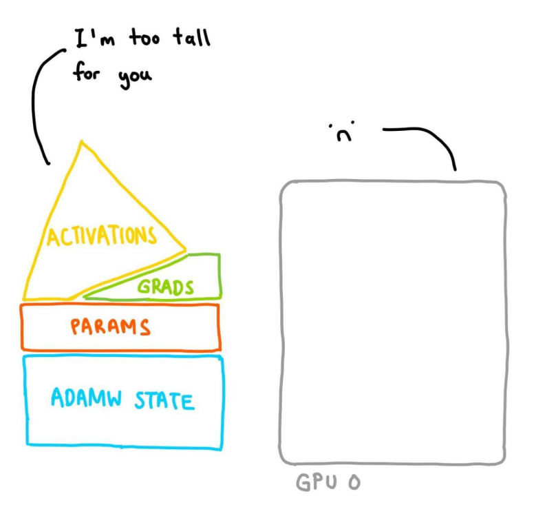

# CogVideoX Factory 🧪

[Read this in English](./README_zh.md)

在 24GB GPU 内存下微调 Cog 系列视频模型以生成自定义视频，支持多种分辨率。 ⚡️📼

<table align="center">
<tr>
  <td align="center"><video src="https://github.com/user-attachments/assets/aad07161-87cb-4784-9e6b-16d06581e3e5">Your browser does not support the video tag.</video></td>
</tr>
</table>

## 快速开始

克隆此仓库并确保已安装所有依赖：`pip install -r requirements.txt`。

然后下载数据集：

```bash
# 安装 `huggingface_hub`
huggingface-cli download   --repo-type dataset Wild-Heart/Disney-VideoGeneration-Dataset   --local-dir video-dataset-disney
```

然后启动文本到视频的 LoRA 微调（根据您的需求修改不同的超参数、数据集根目录和其他配置选项）：

```bash
# 对 CogVideoX 文本到视频模型进行 LoRA 微调
./train_text_to_video_lora.sh

# 对 CogVideoX 文本到视频模型进行全微调
./train_text_to_video_sft.sh

# 对 CogVideoX 图像到视频模型进行 LoRA 微调
./train_image_to_video_lora.sh
```

假设您的 LoRA 已保存并推送到 HF Hub，并命名为 `my-awesome-name/my-awesome-lora`，我们现在可以使用微调后的模型进行推理：

```diff
import torch
from diffusers import CogVideoXPipeline
from diffusers import export_to_video

pipe = CogVideoXPipeline.from_pretrained(
    "THUDM/CogVideoX-5b", torch_dtype=torch.bfloat16
).to("cuda")
+ pipe.load_lora_weights("my-awesome-name/my-awesome-lora", adapter_name=["cogvideox-lora"])
+ pipe.set_adapters(["cogvideox-lora"], [1.0])

video = pipe("<my-awesome-prompt>").frames[0]
export_to_video(video, "output.mp4", fps=8)
```

**注意：** 对于图像到视频的微调，您必须从 [此](https://github.com/huggingface/diffusers/pull/9482) 分支安装
diffusers（该分支添加了 CogVideoX 图像到视频的 LoRA 加载支持），直到它被合并。

在下方的部分中，我们提供了在本仓库中探索的更多选项的详细信息。它们都试图通过尽可能减少内存需求，使视频模型的微调变得尽可能容易。

## 数据集准备

创建两个文件，一个文件包含逐行分隔的提示，另一个文件包含逐行分隔的视频数据路径（视频文件的路径必须相对于您在指定 `--data_root`
时传递的路径）。让我们通过一个示例来更好地理解这一点！

假设您指定的 `--data_root` 为 `/dataset`，并且该目录包含以下文件：`prompts.txt` 和 `videos.txt`。

### 准备提示词数据集

`prompts.txt`
文件应包含逐行分隔的提示。请注意，提示词必须使用英语，建议使用[提示词润色脚本](https://github.com/THUDM/CogVideo/blob/main/inference/convert_demo.py)
进行润色。或者使用 [CogVideo-caption](https://huggingface.co/THUDM/cogvlm2-llama3-caption) 进行标注数据：

```
A black and white animated sequence featuring a rabbit, named Rabbity Ribfried, and an anthropomorphic goat in a musical, playful environment, showcasing their evolving interaction.
A black and white animated sequence on a ship's deck features a bulldog character, named Bully Bulldoger, showcasing exaggerated facial expressions and body language. The character progresses from confident to focused, then to strained and distressed, displaying a range of emotions as it navigates challenges. The ship's interior remains static in the background, with minimalistic details such as a bell and open door. The character's dynamic movements and changing expressions drive the narrative, with no camera movement to distract from its evolving reactions and physical gestures.
...
```

### 准备视频数据集

该框架具体支持的分辨率和帧数如下：

- **分辨率（Width * Height）支持的值**：
    - 256 - 2048 之间的被32整除的任意宽 * 高。比如 `720 * 480`, `1920 * 1020`

- **帧数（Frames）支持的值**：
    - 16, 24, 32, 48, 64, 80。帧数应能被4整除。

`videos.txt` 文件应包含逐行分隔的视频文件路径。请注意，路径应相对于 `--data_root` 目录。格式应该如下:

```bash
videos/00000.mp4
videos/00001.mp4
...
```

愿意探索更多实现细节的开发者可以查看相关的 `BucketSampler` 代码。

### 数据结构

如果在数据集根目录运行 `tree` 命令，您的数据集应如下所示：

```bash
/dataset
├── prompts.txt
├── videos.txt
├── videos
    ├── videos/00000.mp4
    ├── videos/00001.mp4
    ├── ...
```

使用此格式时，`--caption_column` 必须是 `prompts.txt`，`--video_column` 必须是 `videos.txt`。如果您将数据存储在 CSV
文件中，还可以指定 `--dataset_file` 为 CSV 的路径，`--caption_column` 和 `--video_column` 为 CSV 文件中的实际列名。

例如，让我们使用[这个](https://huggingface.co/datasets/Wild-Heart/Disney-VideoGeneration-Dataset) Disney
数据集进行微调。要下载，您可以使用 🤗 Hugging Face CLI。

```bash
huggingface-cli download --repo-type dataset Wild-Heart/Disney-VideoGeneration-Dataset --local-dir video-dataset-disney
```

TODO：添加一个关于创建和使用预计算嵌入的部分。

## 训练

我们提供了与 [Cog 系列模型](https://huggingface.co/collections/THUDM/cogvideo-66c08e62f1685a3ade464cce)
兼容的文本到视频和图像到视频生成的训练脚本。

查看 `*.sh` 文件。

注意：本代码未在 MPS 上测试，建议在 Linux 环境下使用 CUDA文件测试。

## 内存需求

<table align="center">
<tr>
  <td align="center"><a href="https://www.youtube.com/watch?v=UvRl4ansfCg"> 使用 PyTorch 消除 OOM</a></td>
</tr>
<tr>
  <td align="center"></td>
</tr>
</table>

支持和验证的内存优化训练选项包括：

- [`torchao`](https://github.com/pytorch/ao) 中的 `CPUOffloadOptimizer`
  。您可以阅读它的能力和限制 [此处](https://github.com/pytorch/ao/tree/main/torchao/prototype/low_bit_optim#optimizer-cpu-offload)
  。简而言之，它允许您使用 CPU 存储可训练的参数和梯度。这导致优化器步骤在 CPU 上进行，需要一个快速的 CPU
  优化器，例如 `torch.optim.AdamW(fused=True)` 或在优化器步骤上应用 `torch.compile`。此外，建议不要将模型编译用于训练。梯度裁剪和积累尚不支持。
- [`bitsandbytes`](https://huggingface.co/docs/bitsandbytes/optimizers) 中的低位优化器。
    - TODO：测试并使 [`torchao`](https://github.com/pytorch/ao/tree/main/torchao/prototype/low_bit_optim) 工作
- DeepSpeed Zero2：由于我们依赖 `accelerate`
  ，请按照[本指南](https://huggingface.co/docs/accelerate/en/usage_guides/deepspeed) 配置 `accelerate` 以启用 DeepSpeed
  Zero2 优化。

> [!IMPORTANT]
> 内存需求是在运行 `training/prepare_dataset.py` 后报告的，它将视频和字幕转换为潜变量和嵌入。在训练过程中，我们直接加载潜变量和嵌入，而不需要
> VAE 或 T5 文本编码器。但是，如果您执行验证/测试，则必须加载这些内容，并增加所需的内存量。不执行验证/测试可以节省大量内存，对于使用较小
> VRAM 的 GPU，这可以用于专注于训练。
>
> 如果您选择运行验证/测试，可以通过指定 `--enable_model_cpu_offload` 在较低 VRAM 的 GPU 上节省一些内存。

### LoRA 微调

> [!NOTE]
> 图像到视频 LoRA 微调的内存需求与 `THUDM/CogVideoX-5b` 上的文本到视频类似，因此未明确报告。
>
> I2V训练会使用视频的第一帧进行微调。 要为 I2V 微调准备测试图像，您可以通过修改脚本动态生成它们，或使用以下命令从您的训练数据中提取一些帧：
> `ffmpeg -i input.mp4 -frames:v 1 frame.png`，
> 或提供一个有效且可访问的图像 URL。
